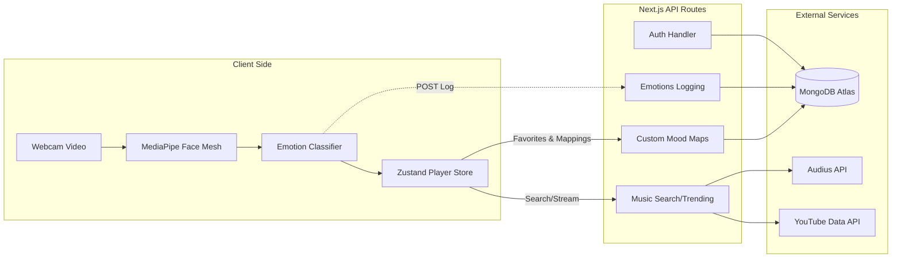

# FaceTune 🎵

[](https://nextjs.org/)
[](https://react.dev/)
[](https://tailwindcss.com/)
[](https://www.mongodb.com/)
[](https://authjs.dev/)

FaceTune is an interactive, AI-powered music companion that captures real-time facial expressions through your webcam, detects your dominant emotion, and recommends customized soundtracks matching your mood. Designed with a premium dark glassmorphic UI, it supports custom mood song bindings, listening analytics, and secure authorization.

🔗 **Live Application**: [https://face-tune.vercel.app](https://face-tune.vercel.app)


---

## 🌟 Core Features

- **Real-Time Emotion Tracking**: Powered by client-side Google **MediaPipe Tasks Vision** detecting 7 primary emotions (*Happy, Sad, Angry, Surprised, Fearful, Disgusted, and Neutral*).
- **Smart Music Recommender**: Queries matching playlists dynamically from the decentralized **Audius API Network** and fallback **YouTube Data API**.
- **Custom Song Mapping**: Empower users to search and assign specific songs to any emotion, overriding the defaults.
- **Fixed Music Player**: Frosted glass music bar supporting playback queues, dynamic volume scaling, repeat/shuffle, and fullscreen ambient visualizers.
- **Mood Analytics**: Visual charts mapping user mood logs and listening history trends over time.
- **Secure Authentication**: Credentials and OAuth login options powered securely by **Auth.js (NextAuth v5)**.

---

## 🛠️ Technology Stack

- **Framework**: Next.js v16.2.7 (App Router, Turbopack)
- **Frontend Library**: React v19.2.7
- **Styling**: Tailwind CSS v4.3.0 with PostCSS
- **Animations**: Framer Motion v12.4.0 (for smooth UI interactions & drag effects)
- **Database**: MongoDB Atlas via Mongoose v9.6.3 (ODM)
- **State Management**: Zustand v5.0.14 (audio player store)
- **Computer Vision**: Google @mediapipe/tasks-vision v0.10.35 (Face Landmarker model)
- **Analytics Visuals**: Recharts v3.8.1 (responsive mood and trend charts)

---

## 🌐 System Architecture

FaceTune runs on a classic client-server model:



---

## 🗄️ Database Models

FaceTune structures its data using Mongoose schemas:

- **User**: Handles user registration, hashed credentials, and avatar parameters.
- **EmotionHistory**: Logs detected emotions, confidence levels, and timestamp entries for user history.
- **CustomMoodTrack**: Stores personalized song associations mapped by the user to specific emotions.
- **Favorite**: Keeps track of liked/saved items mapped for quick access.

---

## 📁 Repository Structure

```
FaceTune/
├── public/
│   └── models/
│       └── face_landmarker.task  # MediaPipe Vision model file
├── src/
│   ├── app/                      # App Router folders & pages
│   │   ├── (auth)/               # Registration & Login pages
│   │   ├── (dashboard)/          # Dashboard pages (Home, Discover, Analytics, etc.)
│   │   ├── api/                  # Backend Next.js API Routes
│   │   └── globals.css           # Styling rules & custom classes
│   ├── components/               # Header, Sidebar, and MusicPlayer elements
│   ├── hooks/                    # MediaPipe hook implementation
│   ├── lib/                      # YouTube API, Audius API, DB clients, and classifiers
│   ├── models/                   # Mongoose DB schema definitions
│   ├── providers/                # React context providers (Emotion, MusicPlayer)
│   ├── stores/                   # Zustand stores for player state
│   └── types/                    # TypeScript interfaces and definitions
```

---

## 🚀 Quick Start

### 1. Install Dependencies
```bash
npm install
```

### 2. Configure Environment Variables
Create a `.env.local` file in the root directory and add your database/OAuth secret configurations:
```properties
MONGODB_URI=mongodb+srv://<username>:<password>@cluster.mongodb.net/facetune
AUTH_SECRET=your_nextauth_auth_secret_string
NEXTAUTH_URL=http://localhost:3000
```

### 3. Run Development Server
```bash
npm run dev
```
Open [http://localhost:3000](http://localhost:3000) inside your web browser.

### 4. Build for Production
```bash
npm run build
npm run start
```
